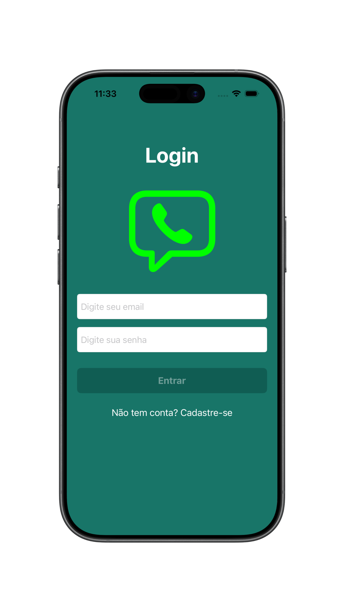
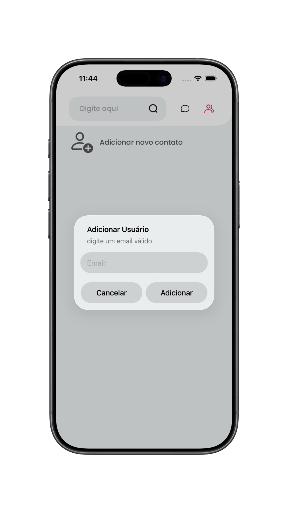
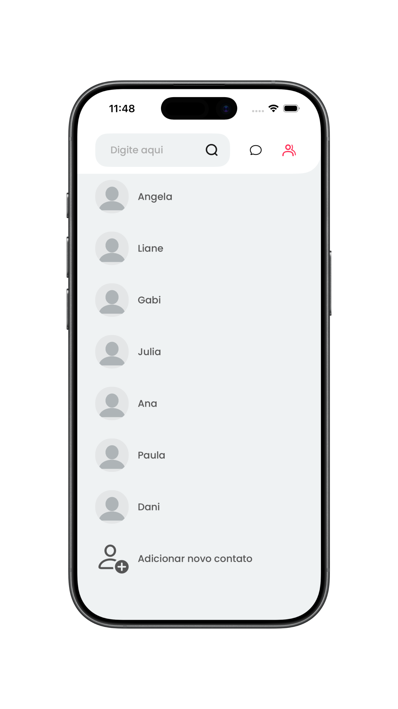
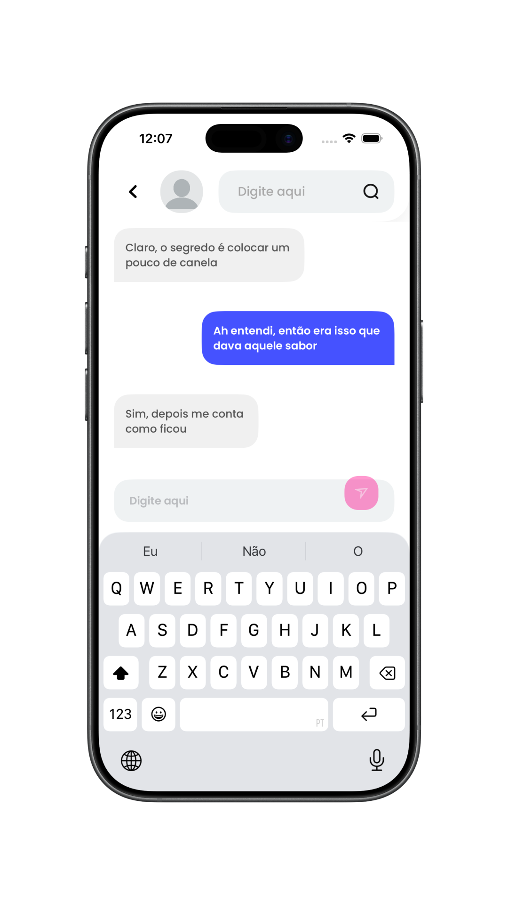
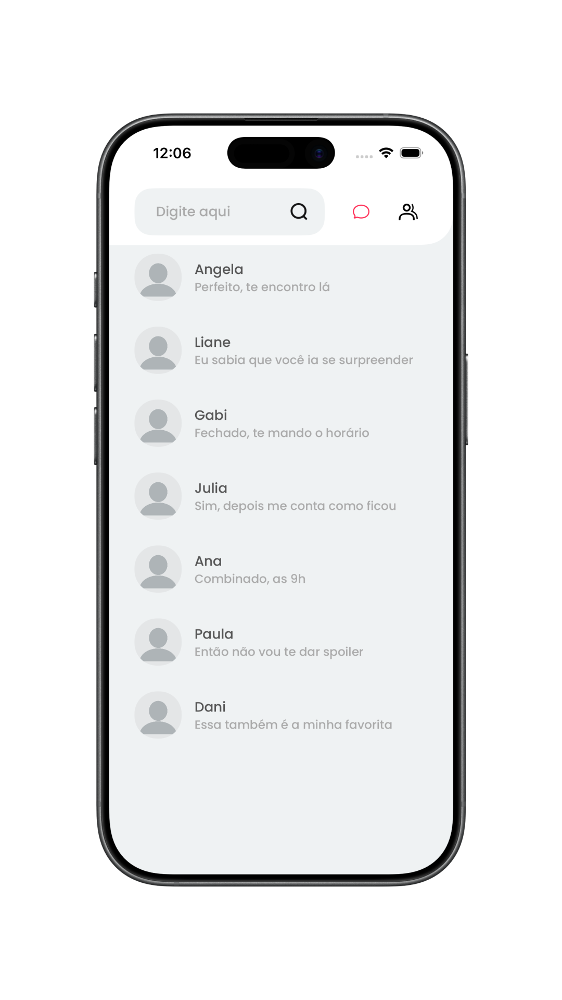

<div align="center">
  

  # SwiftChat

  Um aplicativo iOS para conversar em tempo real com contatos cadastrados.

  [](https://www.swift.org/)
  [](https://developer.apple.com/documentation/uikit)
  [](#arquitetura)
</div>

## 📱 Sobre o projeto

O **SwiftChat** é um aplicativo de mensagens para iPhone. O usuário pode criar uma conta ou entrar com e-mail e senha, adicionar outras pessoas cadastradas como contatos e iniciar conversas individuais. A tela inicial alterna entre contatos e conversas, exibindo a última mensagem de cada conversa.

As mensagens de texto são armazenadas no **Cloud Firestore** e atualizadas na interface por meio de listeners em tempo real. A autenticação utiliza **Firebase Authentication**. O projeto foi desenvolvido em **Swift**, com **UIKit e View Code**, e organiza as telas seguindo **MVVM**.

## 🖼️ Demonstração

<p align="center">
  
  
  
  
  
</p>

## ✨ Funcionalidades

- Cadastro e login com e-mail e senha
- Adição de contatos pelo e-mail de usuários cadastrados
- Alternância entre lista de contatos e lista de conversas
- Conversas individuais com envio e recebimento de mensagens de texto
- Atualização em tempo real das mensagens e das conversas
- Exibição da última mensagem na lista de conversas

## 🛠️ Tecnologias

| Tecnologia | Uso no projeto |
| --- | --- |
| Swift 5 | Linguagem principal |
| UIKit + View Code | Construção das telas e componentes por código |
| MVVM | Organização das responsabilidades das telas |
| Firebase Authentication | Cadastro e autenticação de usuários |
| Cloud Firestore | Armazenamento de usuários, contatos, conversas e mensagens |
| Swift Package Manager | Gerenciamento das dependências do Firebase |

<a id="arquitetura"></a>

## 🏗️ Arquitetura

Cada fluxo principal possui uma `Screen`, uma `ViewController` e uma `ViewModel`. Os modelos de dados e os componentes visuais compartilhados ficam em pastas próprias.

```text
SwiftChat/
├── App/             # Inicialização do aplicativo e configuração do Firebase
├── Features/        # Login, cadastro, início, chat e células das listas
├── Model/           # Contato, conversa e mensagem
├── DesignSystem/    # Cores, fontes, componentes e som
├── Resources/       # Ícones e imagens do aplicativo
└── Utils/           # Extensões compartilhadas
```

O fluxo das telas segue, de forma simplificada:

```text
Screen → ViewController ⇄ ViewModel → Firebase Authentication / Cloud Firestore
```

## 🚀 Como executar

1. Clone o repositório:

   ```bash
   git clone https://github.com/julianosgarbossa/SwiftChat.git
   cd SwiftChat
   ```

2. Crie um projeto no [Firebase Console](https://console.firebase.google.com/) e configure:

   - Adicione um app iOS com o Bundle ID `br.com.julianosgarbossa.SwiftChat`.
   - Em **Authentication → Sign-in method**, habilite **E-mail/senha**.
   - Crie um banco **Cloud Firestore** e configure regras que permitam aos usuários autenticados acessar os dados necessários ao app.
   - Baixe o `GoogleService-Info.plist` e coloque-o em `SwiftChat/GoogleService-Info.plist`.

3. Abra `SwiftChat.xcodeproj` no Xcode, aguarde a resolução dos pacotes, selecione um simulador de iPhone compatível e execute com `⌘R`. O projeto está configurado com destino mínimo **iOS 26.5**.

4. Crie uma conta na tela de cadastro. Para testar uma conversa entre usuários, cadastre duas contas e adicione o e-mail de uma delas como contato na outra.

> O `GoogleService-Info.plist` está incluído no `.gitignore`. Mantenha esse arquivo apenas no seu ambiente local e não o envie em commits.
